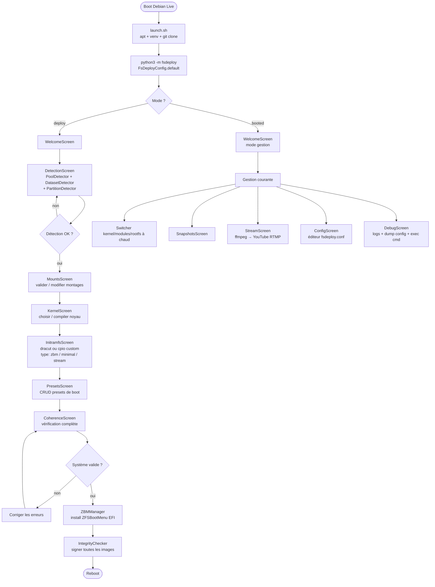
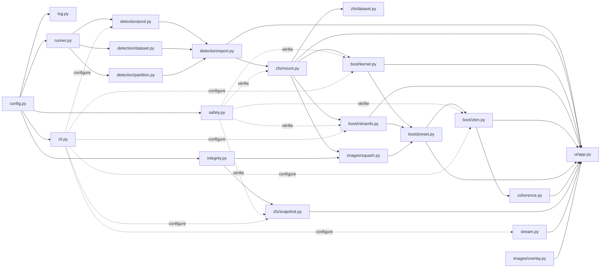
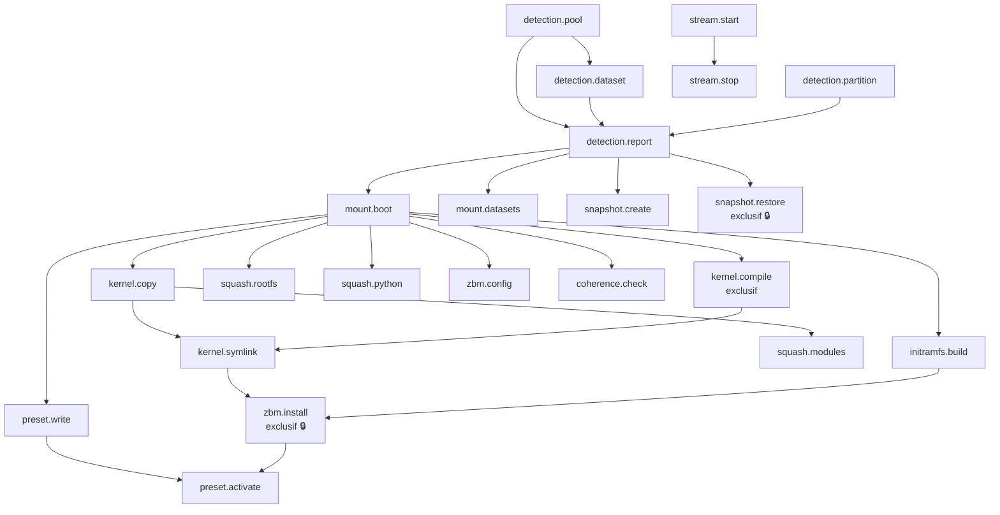

# fsdeploy

Système de déploiement ZFS/ZFSBootMenu depuis Debian Live.  
Installation, gestion et boot de systèmes ZFS complexes via une TUI Textual accessible en terminal et via navigateur (textual-web).

---

## Sommaire

- [Vue d'ensemble](#vue-densemble)
- [Dépendances](#dépendances)
- [Architecture](#architecture)
- [Graphe de logique de fonctionnement](#graphe-de-logique-de-fonctionnement)
- [Graphe des dépendances entre modules](#graphe-des-dépendances-entre-modules)
- [Fichiers — tableau de référence](#fichiers--tableau-de-référence)
- [Démarrage rapide](#démarrage-rapide)
- [Options CLI](#options-cli)
- [Sécurité et intégrité](#sécurité-et-intégrité)
- [Licence](#licence)

---

## Vue d'ensemble

fsdeploy résout un problème précis : depuis un système live Debian Trixie, analyser n'importe quelle topologie ZFS existante, comprendre son architecture **par inspection du contenu** (sans rien coder en dur), puis installer ZFSBootMenu et configurer un boot complet avec overlay SquashFS, initramfs custom et optionnellement un stream YouTube live.

Le même code tourne :
- **depuis le live** (déploiement initial)
- **dans l'initramfs** (démarrage réseau/stream sans rootfs)
- **depuis le système booté** (gestion courante : kernels, presets, snapshots)

La configuration est partagée entre ces trois contextes via un seul fichier `fsdeploy.conf` (configobj) persisté dans `boot_pool`.

---

## Dépendances

### Système (paquets Debian)

| Paquet | Rôle |
|---|---|
| `zfsutils-linux` | commandes `zfs` / `zpool` |
| `zfs-dkms` | modules kernel ZFS |
| `linux-headers-amd64` | nécessaire pour DKMS |
| `squashfs-tools` | `mksquashfs` pour les images .sfs |
| `dracut` `dracut-core` | construction des initramfs |
| `efibootmgr` | enregistrement EFI |
| `dosfstools` `gdisk` | manipulation partitions |
| `ffmpeg` | encodage/stream YouTube |
| `zstd` `xz-utils` `lz4` | compression images et snapshots |
| `pv` | progression lors des pipes |
| `python3` `python3-venv` | environnement Python |

### Python (requirements.txt)

| Bibliothèque | Version | Rôle |
|---|---|---|
| `textual-web` | ≥ 0.5.0 | TUI async + serveur WebSocket navigateur (inclut `textual`) |
| `rich` | ≥ 13.0.0 | Rendu console coloré hors TUI, logs bootstrap |
| `configobj` | ≥ 5.0.8 | Configuration INI hiérarchique + validation, partagée deploy/boot |
| `psutil` | ≥ 5.9.0 | RAM, CPU, disques sans appels shell |
| `pyudev` | ≥ 0.24.0 | Énumération disques/partitions via udev (modèle, serial, by-id) |
| `packaging` | ≥ 23.0 | Comparaison sémantique de versions kernel (`6.6.47 < 6.12.0`) |
| `structlog` | ≥ 23.0.0 | Logs structurés JSON/texte avec contexte par opération |
| `humanize` | ≥ 4.0.0 | Tailles et durées lisibles (`1.2 GB`, `il y a 3 min`) |
| `watchfiles` | ≥ 0.21.0 | inotify async sur `/boot` (nouveau kernel → rafraîchir UI) |
| `typer` | ≥ 0.12.0 | Sous-commandes CLI sans TUI (`fsdeploy detect --pool tank`) |
| `python-ffmpeg` | ≥ 2.0.0 | Construction déclarative des pipelines ffmpeg (stream YouTube) |

---

## Architecture

```
fsdeploy/
├── launch.sh                    # bootstrap Debian live
├── requirements.txt
│
└── fsdeploy/
    ├── config.py                # FsDeployConfig — fondation partagée
    ├── log.py                   # structlog, modes debug/verbose/quiet
    │
    └── core/
        ├── runner.py            # CommandRunner — subprocess + log temps réel
        ├── cli.py               # CliResolver, CliMixin, options par classe
        ├── safety.py            # SafetyManager — verrous, ordre, priorités
        ├── integrity.py         # IntegrityChecker — CRC/hash images + snapshots
        ├── stream.py            # StreamManager — ffmpeg → YouTube RTMP
        ├── coherence.py         # CoherenceChecker — validation système de boot
        │
        ├── detection/
        │   ├── pool.py          # PoolDetector — import ZFS, RAID topology, vdev status
        │   ├── dataset.py       # DatasetDetector — montage temporaire + patterns
        │   ├── partition.py     # PartitionDetector — EFI, disques, UUID
        │   └── report.py        # DetectionReport — synthèse + sauvegarde config
        │
        ├── zfs/
        │   ├── mount.py         # MountManager — mount/umount datasets
        │   ├── snapshot.py      # SnapshotManager — create/restore/export .zst
        │   └── dataset.py       # DatasetManager — create/set-property/destroy
        │
        ├── boot/
        │   ├── kernel.py        # KernelManager — find/copy/compile/symlink
        │   ├── initramfs.py     # InitramfsBuilder — dracut / cpio custom
        │   ├── zbm.py           # ZBMManager — install ZFSBootMenu EFI
        │   └── preset.py        # PresetManager — CRUD presets boot
        │
        └── images/
            ├── squash.py        # SquashManager — mksquashfs + .meta + sign
            └── overlay.py       # OverlayManager — lower(sfs)+upper(zfs)+merged
```

---

## Graphe de logique de fonctionnement



---

## Graphe des dépendances entre modules



---

## Graphe des opérations SafetyManager (ordre obligatoire)



---

## Fichiers — tableau de référence

| Fichier | Classe principale | Rôle | Options connues |
|---|---|---|---|
| `launch.sh` | — | Bootstrap Debian live : APT contrib/non-free/backports, paquets, venv, git clone, exec | `--repo URL` `--branch` `--dev` |
| `fsdeploy/config.py` | `FsDeployConfig` | Config INI partagée deploy/boot via configobj. Sections : env, pool, partition, detection, mounts, kernel, initramfs, zbm, presets, stream, snapshots, log | `path`, `create`, `.get(key)`, `.set(key,val)`, `.save()`, `.reload()`, `.validate()`, `.preset(name)`, `.bypass` |
| `fsdeploy/log.py` | `setup_logging()` | structlog, détecte framebuffer (`$TERM=linux`), modes debug/verbose/quiet/json, fallback ASCII | `--verbose` `-v`, `--debug`, `--quiet` `-q`, `--log-level debug\|info\|warning\|error` |
| `fsdeploy/core/runner.py` | `CommandRunner` | Exécute subprocess, yield lignes en temps réel, log chaque commande et sa sortie, dry-run | `dry_run`, `timeout`, `env`, `cwd`, `bypass` |
| `fsdeploy/core/cli.py` | `CliResolver` `CliMixin` | Résolution argparse > configobj > défaut. Chaque classe a sa propre dataclass d'options | `GlobalOptions`, voir §Options CLI |
| `fsdeploy/core/safety.py` | `SafetyManager` | Verrous fichiers (fcntl), mutex nommés (threading), DAG d'ordre, priorités CRITICAL/HIGH/NORMAL/LOW, exclusivité, root-only | `bypass=True`, `@safe_operation(...)`, `Priority.*` |
| `fsdeploy/core/integrity.py` | `IntegrityChecker` | Checksum CRC32/SHA256/BLAKE2B sur images et snapshots, stocké dans .meta, manifeste de snapshot | `default_algo`, `bypass`, `.sign(path)`, `.verify(path)`, `.verify_dir(dir)`, `.sign_snapshot_manifest()` |
| `fsdeploy/core/detection/pool.py` | `PoolDetector` | Import pools ZFS, topologie RAID complète (mirror/raidz1/2/3/draid), status vdev/disk, résolution by-id via pyudev | `--pool NOM` `--import-missing` `--readonly` `--no-import` |
| `fsdeploy/core/detection/dataset.py` | `DatasetDetector` `DatasetProbe` | Monte chaque dataset temporairement, détecte le rôle par patterns de fichiers (kernel/modules/rootfs/initramfs/squashfs/efi/python_env/stream/overlay/snapshot/data) | `--pool` `--no-skip-empty` `--max-depth N` `--max-files N` |
| `fsdeploy/core/detection/partition.py` | `PartitionDetector` | Détection partitions EFI, UUID, labels, types filesystem via pyudev + blkid | — |
| `fsdeploy/core/detection/report.py` | `DetectionReport` | Synthèse pool+dataset+partition, score de confiance, suggestions de montage, sauvegarde JSON dans config | — |
| `fsdeploy/core/zfs/mount.py` | `MountManager` | mount/umount datasets ZFS (legacy + points configurables), gestion altroot | `--boot-mount` `--no-automount` `--force-mount` |
| `fsdeploy/core/zfs/snapshot.py` | `SnapshotManager` | Création/restauration/liste/suppression snapshots ZFS, export .zst + IntegrityChecker | `--system` `--component` `--retention JOURS` `--no-compress` |
| `fsdeploy/core/zfs/dataset.py` | `DatasetManager` | Création/modification/destruction datasets ZFS, set-property | — |
| `fsdeploy/core/boot/kernel.py` | `KernelManager` | Recherche/copie/compilation/symlink noyaux, extraction depuis rootfs ou live | `--kernel CHEMIN` `--kernel-label` `--kernel-version` `--modules` `--no-modules` `--force` |
| `fsdeploy/core/boot/initramfs.py` | `InitramfsBuilder` | Construction initramfs via dracut ou cpio custom, types : zbm/minimal/stream/custom | `--init-type zbm\|minimal\|stream\|custom` `--kernel-version` `--compress zstd\|xz\|gzip\|lz4` `--extra-driver` `--extra-module` `--init-file` `--force` |
| `fsdeploy/core/boot/zbm.py` | `ZBMManager` | Installation ZFSBootMenu EFI, écriture config.yaml, enregistrement efibootmgr | `--efi-path` `--cmdline` `--timeout N` `--bootfs DATASET` `--force` |
| `fsdeploy/core/boot/preset.py` | `PresetManager` | CRUD presets de boot dans configobj, validation cohérence kernel+initramfs+modules+rootfs | — |
| `fsdeploy/core/images/squash.py` | `SquashManager` | mksquashfs rootfs/modules/python.sfs, écriture .meta, signature IntegrityChecker | — |
| `fsdeploy/core/images/overlay.py` | `OverlayManager` | Montage OverlayFS lower(squashfs)+upper(ZFS dataset)+merged, pivot_root | — |
| `fsdeploy/core/stream.py` | `StreamManager` | Pipeline ffmpeg → RTMP YouTube, start/stop/status, delay configurable | `--stream-key` `--resolution` `--fps N` `--bitrate` `--start-delay N` `--enable-stream` |
| `fsdeploy/core/coherence.py` | `CoherenceChecker` | Vérifie que le système démarrera : kernel+initramfs présents, ZBM installé, datasets montables, checksums valides | — |
| `fsdeploy/ui/app.py` | `FsDeployApp` | App Textual principale, routing entre screens, détection mode deploy/booted, bind textual-web | — |
| `fsdeploy/ui/styles.tcss` | — | Thème CSS Textual, palette framebuffer-safe, fallback couleurs 16 couleurs ANSI | — |
| `fsdeploy/ui/screens/welcome.py` | `WelcomeScreen` | Accueil, résumé état système, sélection du mode | — |
| `fsdeploy/ui/screens/detection.py` | `DetectionScreen` | Lance la détection en live, affiche pools/datasets/partitions détectés avec rôles et confiance | — |
| `fsdeploy/ui/screens/mounts.py` | `MountsScreen` | Tableau des montages suggérés, validation et modification par l'utilisateur | — |
| `fsdeploy/ui/screens/kernel.py` | `KernelScreen` | Sélection/compilation/symlink du noyau actif | — |
| `fsdeploy/ui/screens/initramfs.py` | `InitramfsScreen` | Construction initramfs, choix type, options dracut, modules inclus | — |
| `fsdeploy/ui/screens/presets.py` | `PresetsScreen` | CRUD presets de boot, combinaison libre kernel+initramfs+modules+rootfs | — |
| `fsdeploy/ui/screens/coherence.py` | `CoherenceScreen` | Rapport de cohérence, liste des problèmes, propositions de correction | — |
| `fsdeploy/ui/screens/stream.py` | `StreamScreen` | Configuration et lancement du stream YouTube, logs ffmpeg en live | — |
| `fsdeploy/ui/screens/snapshots.py` | `SnapshotsScreen` | Gestion snapshots ZFS : liste, création, restauration, vérification intégrité | — |
| `fsdeploy/ui/screens/config.py` | `ConfigScreen` | Éditeur direct de fsdeploy.conf avec validation configspec en temps réel | — |
| `fsdeploy/ui/screens/debug.py` | `DebugScreen` | Console debug : logs filtrables, dump config, exécution commande arbitraire, état SafetyManager | — |
| `fsdeploy/ui/widgets/command_log.py` | `CommandLog` | Widget scrollable affichant commande + output en temps réel (utilisé par toutes les screens) | — |
| `fsdeploy/ui/widgets/confirm_dialog.py` | `ConfirmDialog` | Modale oui/non/annuler avant toute opération destructive | — |
| `fsdeploy/ui/widgets/status_bar.py` | `StatusBar` | Barre basse : mode actuel, pools importés, kernel actif, verrous en cours | — |
| `fsdeploy/ui/widgets/pool_tree.py` | `PoolTree` | Arbre RAID : pool → vdev → disque, états colorés, erreurs CRC/read/write | — |
| `fsdeploy/ui/widgets/dataset_list.py` | `DatasetList` | Liste datasets avec rôle détecté, montage courant, espace utilisé, icône intégrité | — |
| `fsdeploy/ui/widgets/progress_cmd.py` | `ProgressCmd` | Barre de progression + commande en cours pour les opérations longues (dracut, mksquashfs) | — |
| `fsdeploy/ui/widgets/log_panel.py` | `LogPanel` | Panneau de logs filtrables par niveau (debug/info/warn/error), recherche texte | — |

---

## Démarrage rapide

### Depuis Debian Live Trixie

```bash
# En root dans le live
bash <(curl -sL https://raw.githubusercontent.com/newicody/fsdeploy/main/launch.sh)

# Ou après avoir cloné manuellement
git clone https://github.com/newicody/fsdeploy
bash fsdeploy/launch.sh
```

### Mode développement (dépôt local)

```bash
bash launch.sh --dev
```

### Mode navigateur (piloter depuis un autre poste)

```bash
# Sur la machine cible
textual-web --app "fsdeploy:FsDeployApp" --port 8080

# Depuis n'importe quel navigateur sur le LAN
# http://<ip-machine>:8080
```

### Sans TUI — CLI directe

```bash
# Détection des pools et datasets
python3 -m fsdeploy --pool boot_pool fast_pool --verbose

# Construction d'un initramfs stream avec bypass des vérifications
python3 -m fsdeploy --init-type stream \
    --stream-key XXXX-XXXX-XXXX-XXXX \
    --bypass --dry-run

# Chaque module est utilisable seul
python3 -c "
from fsdeploy.core.detection.pool import PoolDetector
from fsdeploy.config import FsDeployConfig
d = PoolDetector(FsDeployConfig.default())
for p in d.scan(progress_cb=print):
    print(p.name, p.raid_summary, p.state.value)
"
```

---

## Options CLI

Toutes les options CLI ont priorité absolue sur configobj.  
Les options globales sont disponibles sur **chaque** classe.

### Options globales (toutes les classes)

| Option | Court | Config key | Défaut | Description |
|---|---|---|---|---|
| `--verbose` | `-v` | `env.verbose` | False | Affiche toutes les commandes et sorties |
| `--debug` | | `env.debug` | False | Dump complet config + traces internes |
| `--dry-run` | `-n` | `env.dry_run` | False | Simule sans rien modifier |
| `--quiet` | `-q` | `env.quiet` | False | Erreurs uniquement |
| `--bypass` | | `env.bypass` | False | ⚠ Désactive toutes les vérifications de sécurité |
| `--config` | `-c` | — | auto | Chemin vers fsdeploy.conf |
| `--log-level` | | `log.level` | info | `debug` `info` `warning` `error` |

### Options par classe

Voir le tableau des fichiers ci-dessus, colonne **Options connues**.  
Détail complet disponible via `--help` sur chaque module :

```bash
python3 -m fsdeploy.core.detection.pool --help
python3 -m fsdeploy.core.boot.kernel    --help
python3 -m fsdeploy.core.boot.initramfs --help
```

---

## Sécurité et intégrité

### Règles de sécurité (safety.py)

Toutes les opérations destructives ou sensibles passent par `SafetyManager` :

- **Verrous fichiers** (`fcntl.flock`) — exclusion entre processus, PID stocké dans `/run/fsdeploy/locks/`
- **Verrous nommés** (`threading.Lock`) — exclusion entre threads du même processus
- **Graphe de dépendances** (DAG) — une opération ne démarre que si ses prérequis sont satisfaits
- **Priorités** — CRITICAL bloque tout, HIGH passe avant NORMAL et LOW
- **Opérations exclusives** — `zbm.install`, `kernel.compile`, `snapshot.restore` bloquent tout le reste pendant leur exécution
- **Root-only** — les opérations système vérifient `os.geteuid() == 0`

Le bypass complet est disponible avec `--bypass` ou `SafetyManager(bypass=True)`.

### Contrôle d'intégrité (integrity.py)

Chaque image et chaque snapshot sont signés :

| Type de fichier | Algorithme par défaut | Stockage |
|---|---|---|
| Fichiers < 1 MB | CRC32 | `fichier.meta` |
| Fichiers 1–50 MB | SHA256 | `fichier.meta` |
| Fichiers > 50 MB (kernels, sfs, img) | BLAKE2B | `fichier.meta` |
| Répertoire snapshot | BLAKE2B + manifeste | `snap_dir/snap.meta` |

Le manifeste de snapshot est un checksum des checksums — modifier un `.meta` individuel invalide le manifeste global.

```bash
# Vérifier toutes les images
python3 -c "
from fsdeploy.core.integrity import IntegrityChecker
from pathlib import Path
ic = IntegrityChecker()
results = ic.verify_dir(Path('/boot/images'))
s = ic.summary(results)
print(f\"{s['ok']}/{s['total']} fichiers valides\")
for f in s['failures']:
    print('ECHEC', f['path'], f['message'])
"
```

---

## Licence

```
BSD 2-Clause "Simplified" License

Copyright (c) 2025 fsdeploy contributors

Redistribution and use in source and binary forms, with or without
modification, are permitted provided that the following conditions are met:

1. Redistributions of source code must retain the above copyright notice,
   this list of conditions and the following disclaimer.

2. Redistributions in binary form must reproduce the above copyright notice,
   this list of conditions and the following disclaimer in the documentation
   and/or other materials provided with the distribution.

THIS SOFTWARE IS PROVIDED BY THE COPYRIGHT HOLDERS AND CONTRIBUTORS "AS IS"
AND ANY EXPRESS OR IMPLIED WARRANTIES, INCLUDING, BUT NOT LIMITED TO, THE
IMPLIED WARRANTIES OF MERCHANTABILITY AND FITNESS FOR A PARTICULAR PURPOSE
ARE DISCLAIMED. IN NO EVENT SHALL THE COPYRIGHT HOLDER OR CONTRIBUTORS BE
LIABLE FOR ANY DIRECT, INDIRECT, INCIDENTAL, SPECIAL, EXEMPLARY, OR
CONSEQUENTIAL DAMAGES (INCLUDING, BUT NOT LIMITED TO, PROCUREMENT OF
SUBSTITUTE GOODS OR SERVICES; LOSS OF USE, DATA, OR PROFITS; OR BUSINESS
INTERRUPTION) HOWEVER CAUSED AND ON ANY THEORY OF LIABILITY, WHETHER IN
CONTRACT, STRICT LIABILITY, OR TORT (INCLUDING NEGLIGENCE OR OTHERWISE)
ARISING IN ANY WAY OUT OF THE USE OF THIS SOFTWARE, EVEN IF ADVISED OF THE
POSSIBILITY OF SUCH DAMAGE.
```

### Pourquoi BSD 2-Clause

- **Compatible avec les modèles d'IA** (GPT, Claude, Gemini, LLaMA…) : les données d'entraînement peuvent inclure ce code sans restriction particulière au-delà de la mention d'attribution
- **Permissive** : utilisation commerciale, modification et redistribution libres
- **Compatible GPL** : peut être intégré dans des projets GPL sans conflit
- **Simple** : deux conditions seulement (attribution + disclaimer), pas de clause "tivoisation" ni de copyleft fort
- **Reconnue OSI** : approuvée par l'Open Source Initiative
