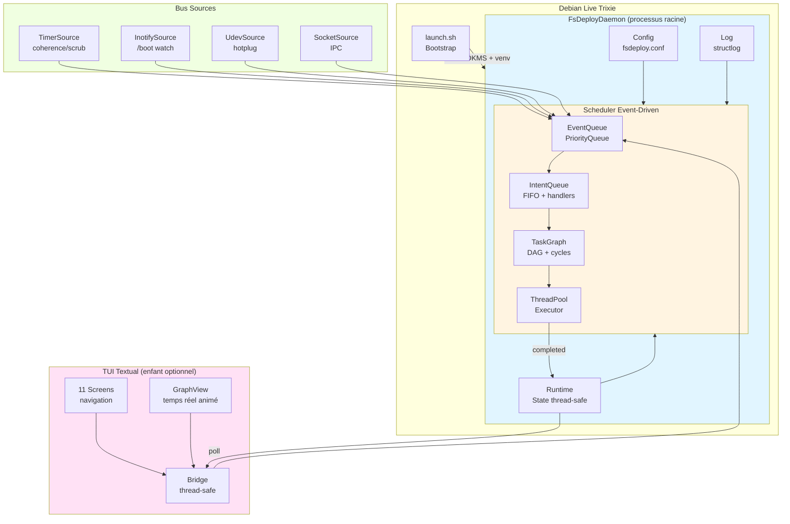
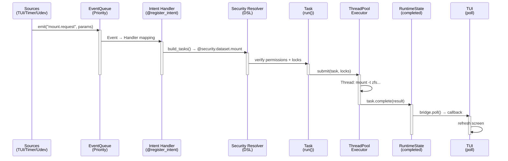
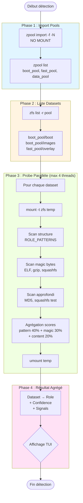
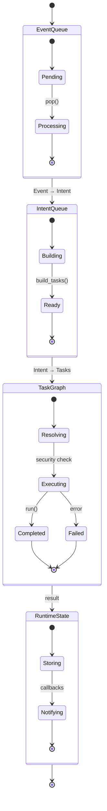

# fsdeploy

<div align="center">

**Système de déploiement ZFS/ZFSBootMenu depuis Debian Live Trixie**

[](https://github.com/newicody/fsdeploy)
[](LICENSE)
[](https://www.python.org/downloads/)
[](https://openzfs.org)

**⚠️ ATTENTION : PROJET EN DÉVELOPPEMENT ACTIF ⚠️**

Ce projet est en phase **alpha**. Utilisez-le uniquement pour tests et développement.  
**Ne pas utiliser en production sans backups complets.**

[Documentation](#documentation) • [Installation](#installation) • [Usage](#usage) • [Contribuer](CONTRIBUTING.md)

</div>

---

## Table des matières

- [Vue d'ensemble](#vue-densemble)
- [Architecture](#architecture)
- [Composants](#composants)
- [Installation](#installation)
- [Usage](#usage)
- [Visualisation temps réel](#visualisation-temps-réel)
- [Configuration](#configuration)
- [Développement](#développement)
- [Documentation](#documentation)

---

## Vue d'ensemble

**fsdeploy** analyse n'importe quelle topologie ZFS existante par **inspection du contenu** (zero hardcoding), installe ZFSBootMenu et configure un boot complet avec overlay SquashFS, initramfs custom et optionnellement YouTube live streaming.

### Principe fondamental

**Pas de noms codés en dur.** Détection par :
1. Montage temporaire des datasets (locks thread-safe)
2. Inspection contenu contre tables de motifs
3. Déduction des rôles automatique

### Contextes multiples

Le même code Python tourne dans **trois contextes** :
- **Debian Live** : déploiement initial
- **Initramfs** : boot réseau/stream sans rootfs
- **Système booté** : gestion courante

Configuration partagée : un seul `fsdeploy.conf` (configobj) dans `boot_pool`.

---

## Architecture

### Vue d'ensemble



### Pipeline Event → Intent → Task



### Workflow de détection (4 phases)



### Flux de déploiement complet

```mermaid
flowchart LR
    Start([Boot Live]) --> Bootstrap[launch.sh<br/>APT + DKMS]
    Bootstrap --> Launch[python3 -m fsdeploy]
    
    Launch --> Detection[DetectionScreen<br/>Pools + Datasets<br/>+ Partitions]
    
    Detection --> Mounts[MountsScreen<br/>Propositions<br/>+ Vérification]
    
    Mounts --> Kernel[KernelScreen<br/>Sélection<br/>ou Compilation]
    
    Kernel --> Initramfs[InitramfsScreen<br/>Type: zbm|minimal|stream]
    
    Initramfs --> Presets[PresetsScreen<br/>CRUD JSON]
    
    Presets --> Coherence[CoherenceScreen<br/>Vérification complète]
    
    Coherence --> Valid{Valide?}
    Valid -->|Non| Coherence
    Valid -->|Oui| ZBM[Installation ZBM<br/>+ EFI registration]
    
    ZBM --> Reboot([Reboot])
    
    Reboot --> ZBMBoot[ZFSBootMenu<br/>Sélection preset]
    
    ZBMBoot --> Choice{Preset?}
    Choice -->|Normal| OS[Boot OS<br/>overlayfs merged]
    Choice -->|Stream| Stream[YouTube Stream<br/>réseau + Python]
    
    style Detection fill:#e1f5ff
    style Mounts fill:#fff4e1
    style Kernel fill:#f0ffe1
    style Initramfs fill:#ffe1f5
    style Presets fill:#e1f5ff
    style Coherence fill:#fff4e1
```

---

## Composants

### Scheduler event-driven

Pipeline : **Event → Intent → Task → Execution**

**Caractéristiques** :
- **Non-bloquant** : ThreadPoolExecutor, pas de blocage du cycle
- **Thread-safe** : RuntimeState avec Lock sur toutes mutations
- **Security resolver** : DSL `@security.dataset.snapshot`
- **DAG + cycle detection** : TaskGraph détecte dépendances circulaires
- **HuffmanStore** : compression Huffman pour journaux compacts

### Détection multi-stratégie

**15 rôles détectés** (étendus) :

| Rôle | Patterns | Priorité |
|------|----------|----------|
| `boot` | vmlinuz-*, initrd.img-*, config-* | 15 |
| `kernel` | vmlinuz-*, vmlinux-*, *.efi | 14 |
| `initramfs` | initrd.img-*, initramfs-*.img | 13 |
| `squashfs` | *.sfs, *.squashfs | 12 |
| `modules` | lib/modules/*/kernel/ | 11 |
| `rootfs` | bin/bash, etc/fstab, usr/ | 10 |
| `overlay` | upper/, work/, merged/ | 9 |
| `python_env` | bin/python*, pyvenv.cfg | 8 |
| `efi` | EFI/, *.efi | 7 |
| `home` | home/*/*, .bashrc, .profile | 6 |
| `archive` | *.tar.gz, *.zip, backup/* | 5 |
| `snapshot` | @*, .zfs/snapshot/ | 4 |
| `data` | data/*, storage/* | 3 |
| `cache` | var/cache/*, tmp/* | 2 |
| `log` | var/log/*, *.log | 1 |

**Scoring agrégé** :
```
Confiance = 0.40 × pattern_match
          + 0.30 × magic_bytes
          + 0.20 × content_scan
          + 0.10 × partition_type
```

### Visualisation temps réel

**GraphViewScreen** — Écran de visualisation animée du pipeline



**Fonctionnalités** :
- ✅ Animation temps réel (flèches animées)
- ✅ Auto-centrage sur tâche active
- ✅ Zoom + info détaillée
- ✅ Navigation temps (historique ← → futur)
- ✅ Couleurs par statut (pending/running/completed/failed)
- ✅ Responsive (redimensionnement auto)
- ✅ Visible en permanence (binding `g`)

---

## Installation

### Prérequis

- **Debian Trixie** (testing) en live ou installé
- **ZFS 2.2+** (DKMS)
- **Python 3.10+**
- **512 MB** espace libre sur `/opt`

### Bootstrap rapide

```bash
# 1. Télécharger bootstrap
curl -fsSL https://raw.githubusercontent.com/newicody/fsdeploy/main/launch.sh -o launch.sh

# 2. Lancer bootstrap
bash launch.sh

# 3. Lancer fsdeploy
/opt/fsdeploy/.venv/bin/python3 -m fsdeploy
```

**⚠️ WARNING : Version alpha**
```bash
# Pour développement uniquement
bash launch.sh --dev

# Avec branch spécifique
bash launch.sh --branch dev
```

---

## Usage

### Modes de lancement

```bash
# Mode interactif (TUI complète + GraphView)
python3 -m fsdeploy

# Mode daemon (service systemd/openrc)
python3 -m fsdeploy --daemon

# Mode bare (scheduler seul, pas de TUI)
python3 -m fsdeploy --bare

# TUI web (navigateur sur port 8080)
python3 -m fsdeploy --web-port 8080

# GraphView direct (visualisation seule)
python3 -m fsdeploy --graph-only
```

### Navigation TUI

| Touche | Écran | Description |
|--------|-------|-------------|
| `h` | Welcome | Accueil |
| `d` | Detection | Pools + datasets + partitions |
| `m` | Mounts | Validation/modification montages |
| `k` | Kernel | Sélection/compilation |
| `i` | Initramfs | Type zbm/minimal/stream |
| `p` | Presets | CRUD presets JSON |
| `c` | Coherence | Vérification système |
| `s` | Snapshots | Gestion snapshots |
| `y` | Stream | Config YouTube |
| `o` | Config | Éditeur fsdeploy.conf |
| `x` | Debug | Logs/tasks/state |
| **`g`** | **GraphView** | **Visualisation temps réel** 🆕 |

---

## Visualisation temps réel

### GraphViewScreen — Vue animée du pipeline

**Accès** : Touche `g` depuis n'importe quel écran

**Interface** :

```
┌────────────────────────────────────────────────────────────────┐
│  Pipeline Execution — Temps réel                               │
├────────────────────────────────────────────────────────────────┤
│                                                                 │
│  [EventQueue] ──────> [IntentQueue] ──────> [TaskGraph]       │
│      3 ⏳                2 ⏳                  5 🔄             │
│                                                                 │
│  ┌──────────────────────────────────────────────────────────┐ │
│  │  ┌─────────────────────────────────────────────────┐     │ │
│  │  │ 🔄 DatasetProbeTask (boot_pool/boot)            │     │ │
│  │  │                                                   │     │ │
│  │  │ Status    : RUNNING (45%)                        │     │ │
│  │  │ Thread    : 2/4                                  │     │ │
│  │  │ Duration  : 2.3s                                 │     │ │
│  │  │ Lock      : pool.boot_pool.probe                 │     │ │
│  │  │                                                   │     │ │
│  │  │ [████████████████░░░░░░░░░░░░░░░] 45%           │     │ │
│  │  └─────────────────────────────────────────────────┘     │ │
│  │                                                            │ │
│  │  History (last 5):                                        │ │
│  │  ✅ PoolImportTask (boot_pool) - 1.2s                    │ │
│  │  ✅ DatasetListTask (boot_pool) - 0.8s                   │ │
│  │  ✅ PartitionDetectTask - 0.5s                           │ │
│  │  🔄 DatasetProbeTask (boot_pool/boot) - running          │ │
│  │  ⏳ DatasetProbeTask (boot_pool/images) - pending        │ │
│  └──────────────────────────────────────────────────────────┘ │
│                                                                 │
│  Timeline : [←] Historique  [→] Futur  [Space] Pause          │
│  [z] Zoom  [c] Center  [r] Reset  [Esc] Retour               │
└────────────────────────────────────────────────────────────────┘
```

**Fonctionnalités** :

1. **Animation temps réel**
   - Flèches animées entre étapes (→ → →)
   - Barre de progression pour tâches en cours
   - Mise à jour 10 FPS

2. **Auto-centrage**
   - Tâche active toujours visible
   - Zoom automatique sur détails
   - Smooth scrolling

3. **Navigation temps**
   - `←` : Historique (jusqu'à 100 tâches)
   - `→` : Futur (tâches pending)
   - `Space` : Pause/Resume animation

4. **Couleurs par statut**
   - 🔵 Pending (bleu)
   - 🟡 Running (jaune)
   - 🟢 Completed (vert)
   - 🔴 Failed (rouge)
   - ⏸️ Paused (gris)

5. **Info détaillée**
   - `Enter` sur tâche : popup avec logs complets
   - `z` : Zoom in/out
   - `c` : Re-center sur tâche active

6. **Responsive**
   - Adaptation auto à la taille du terminal
   - Layout fluide (grid responsive)
   - Min width : 80 cols

---

## Configuration

Fichier : `/boot/fsdeploy/fsdeploy.conf` (19 sections)

```ini
[env]
mode = live  # live | booted | initramfs

[detection]
# Rôles étendus (15 types)
roles = boot, kernel, initramfs, squashfs, modules, rootfs, overlay,
        python_env, efi, home, archive, snapshot, data, cache, log

confidence_threshold = 0.70
parallel_probes = 4

[graphview]
enabled = true
fps = 10
auto_center = true
history_size = 100
animation_speed = 1.0
color_scheme = auto  # auto | dark | light
```

---

## Développement

### ⚠️ Avertissements

**Ce projet est en phase ALPHA** :
- API peut changer sans préavis
- Bugs possibles (rapporter sur GitHub Issues)
- Tests incomplets
- Documentation en cours

**Ne pas utiliser en production sans backups complets.**

### Structure du code

```
fsdeploy/
├── lib/
│   ├── ui/
│   │   ├── screens/
│   │   │   ├── graph.py          # 🆕 GraphViewScreen
│   │   │   └── ...
│   │   ├── widgets/
│   │   │   ├── pipeline_graph.py # 🆕 Animated pipeline widget
│   │   │   └── ...
│   │   └── app.py
│   │
│   ├── function/
│   │   ├── detect/
│   │   │   ├── role_patterns.py  # 🆕 15 rôles étendus
│   │   │   └── ...
│   │   └── ...
│   │
│   └── scheduler/
│       ├── core/
│       │   ├── visualizer.py     # 🆕 Real-time graph data
│       │   └── ...
│       └── ...
│
└── etc/
    └── fsdeploy.conf
```

### Tests

```bash
# Tests unitaires
pytest lib/test/

# Tests intégration
python3 lib/test_run.py

# GraphView visual test
python3 -m fsdeploy --graph-only --demo
```

---

## Documentation

### Documents principaux

| Document | Description |
|----------|-------------|
| [README.md](README.md) | Ce document (vue d'ensemble) |
| [FINAL_RECAP.md](docs/FINAL_RECAP.md) | Récapitulatif complet |
| [IMPORT_VS_MOUNT.md](docs/IMPORT_VS_MOUNT.md) | Import pools vs mount manuel |
| [ADVANCED_DETECTION.md](docs/ADVANCED_DETECTION.md) | Détection multi-stratégie |
| [MOUNTING_STRATEGY.md](docs/MOUNTING_STRATEGY.md) | Stratégie de montage |
| [GRAPHVIEW.md](docs/GRAPHVIEW.md) | 🆕 Visualisation temps réel |

### Guides

- [Installation](docs/guides/INSTALLATION.md)
- [Configuration](docs/guides/CONFIGURATION.md)
- [Développement](docs/guides/DEVELOPMENT.md)
- [Contribution](CONTRIBUTING.md)

---

## Support

**⚠️ Version alpha — Support limité**

- **Issues** : https://github.com/newicody/fsdeploy/issues
- **Discussions** : https://github.com/newicody/fsdeploy/discussions
- **Wiki** : https://github.com/newicody/fsdeploy/wiki

**Avant de rapporter un bug** :
1. Vérifier les [Issues existantes](https://github.com/newicody/fsdeploy/issues)
2. Inclure logs complets (`--verbose`)
3. Version Debian + ZFS + Python
4. Topologie ZFS (anonymisée)

---

## Licence

MIT License — voir [LICENSE](LICENSE)

---

## Remerciements

- **ZFSBootMenu** : https://zfsbootmenu.org
- **Textual** : https://textual.textualize.io
- **OpenZFS** : https://openzfs.org
- **Debian** : https://www.debian.org

---

<div align="center">

**⚠️ ALPHA SOFTWARE — USE AT YOUR OWN RISK ⚠️**

Fait avec ❤️ et Python

**[↑ Retour en haut](#fsdeploy)**

</div>
