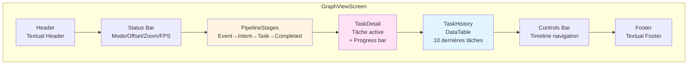
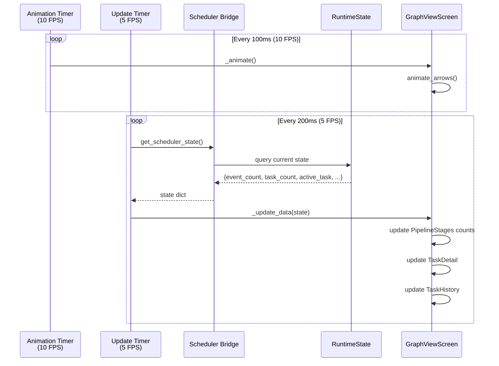

# GraphView — Visualisation temps réel

**Documentation technique** — Visualiseur de pipeline animé pour Textual

---

## Vue d'ensemble

**GraphViewScreen** est un écran Textual qui affiche en **temps réel** le pipeline de traitement fsdeploy :

```
Event → Intent → Task → Execution → Completion
```

Avec :
- ✅ Animation fluide (10 FPS)
- ✅ Auto-centrage sur tâche active
- ✅ Navigation dans le temps (historique/futur)
- ✅ Zoom + info détaillée
- ✅ Couleurs par statut
- ✅ Responsive (adaptation taille terminal)
- ✅ Visible en permanence (binding `g`)

---

## Accès rapide

**Depuis n'importe quel écran de la TUI** : appuyer sur `g`

```bash
# Lancement direct en mode GraphView seul
python3 -m fsdeploy --graph-only

# Avec mode démo (génération de tâches fictives)
python3 -m fsdeploy --graph-only --demo
```

---

## Architecture

### Widgets principaux



### Flux de données



---

## Composants détaillés

### 1. PipelineStages

**Widget** : Affiche les 4 étapes du pipeline avec compteurs.

```
[EventQueue]  →  [IntentQueue]  →  [TaskGraph]  →  [Completed]
   ⏳ 3           ⏳ 2               🔄 5             ✅ 42
```

**Données** :
- `event_count` : Nombre d'events en attente
- `intent_count` : Nombre d'intents en cours de construction
- `task_count` : Nombre de tasks en exécution
- `completed_count` : Nombre total de tasks complétées

**Animation** :
```python
# Cycle d'animation 4 frames (100ms par frame)
arrows = ["→", "→→", "→→→", "→→→→"]

# Ou ASCII fallback si TERM=linux
arrows = ["-", "->", "-->", "--->"]
```

**CSS** :
```css
.stage {
    padding: 0 2;
    text-align: center;
}

.stage-name {
    text-style: bold;
}

.stage-count {
    color: $text-muted;
}

.arrow {
    padding: 0 1;
    color: $accent;
}
```

---

### 2. TaskDetail

**Widget** : Affiche les détails de la tâche active.

```
┌─────────────────────────────────────────────────────────┐
│ 🔄 DatasetProbeTask (boot_pool/boot)                    │
│                                                          │
│ Status    : RUNNING (45%)                               │
│ Thread    : 2/4                                         │
│ Duration  : 2.3s                                        │
│ Lock      : pool.boot_pool.probe                        │
│                                                          │
│ [████████████████░░░░░░░░░░░░░░░] 45%                  │
└─────────────────────────────────────────────────────────┘
```

**Données** (dict `task_data`) :
```python
{
    "id": "probe_boot",
    "name": "DatasetProbeTask (boot_pool/boot)",
    "status": "running",  # pending | running | completed | failed | paused
    "progress": 45,        # 0-100
    "thread_id": 2,
    "max_threads": 4,
    "duration": 2.3,       # secondes
    "lock": "pool.boot_pool.probe",
}
```

**Icônes par statut** :
| Status | Unicode | ASCII (TERM=linux) |
|--------|---------|-------------------|
| pending | ⏳ | [.] |
| running | 🔄 | [*] |
| completed | ✅ | [+] |
| failed | ❌ | [X] |
| paused | ⏸️ | [-] |

**Méthodes** :
```python
def update_task(task_data: dict):
    """Met à jour l'affichage avec les données de tâche."""
    
def clear():
    """Efface l'affichage (aucune tâche active)."""
```

---

### 3. TaskHistory

**Widget** : DataTable affichant les 10 dernières tâches.

```
┌────────────────────────────────────────────────────────┐
│ Status │ Task                              │ Duration  │
├────────────────────────────────────────────────────────┤
│   ✅   │ PoolImportTask (boot_pool)       │ 1.2s      │
│   ✅   │ DatasetListTask (boot_pool)      │ 0.8s      │
│   ✅   │ PartitionDetectTask              │ 0.5s      │
│   🔄   │ DatasetProbeTask (boot_pool/boot)│ running   │
│   ⏳   │ DatasetProbeTask (boot_pool/img) │ pending   │
└────────────────────────────────────────────────────────┘
```

**Fonctionnalités** :
- Stocke jusqu'à **100 tâches** en mémoire
- Affiche les **10 plus récentes**
- Mise à jour automatique quand nouvelle tâche
- Zebra stripes pour lisibilité

**Méthodes** :
```python
def add_task(task_data: dict):
    """Ajoute une tâche à l'historique."""
    
def update_task(task_id: str, updates: dict):
    """Met à jour une tâche existante (status, duration)."""
    
def get_history() -> list[dict]:
    """Retourne l'historique complet (jusqu'à 100)."""
```

---

## Interactions utilisateur

### Bindings (raccourcis clavier)

| Touche | Action | Description |
|--------|--------|-------------|
| `g` | Fermer GraphView | Retour à l'écran précédent |
| `Esc` | Fermer GraphView | Alternative |
| `Space` | Pause/Resume | Gèle l'animation et la mise à jour |
| `r` | Reset | Retour à offset=0, zoom=1x |
| `c` | Center | Centre la vue sur la tâche active |
| `z` | Zoom | Toggle zoom 1x ↔ 2x |
| `←` | Historique | Navigue vers le passé (-1 offset) |
| `→` | Futur | Navigue vers le futur (+1 offset si <0) |

### Navigation dans le temps

**Concept** : L'utilisateur peut "voyager" dans le temps du pipeline.

```
                    [Historique] ← Offset = 0 (présent) → [Futur]
                                        ↑
                                   LIVE MODE
                                 (tâches actives)
```

**Offset** :
- `0` : **Présent** (mode LIVE, tâches en cours)
- `-1` : 1 étape dans le passé (historique)
- `-10` : 10 étapes dans le passé
- `+1` : Ne peut pas aller dans le futur au-delà du présent (limité à 0)

**Exemples** :
```python
# Utilisateur au présent (offset=0)
# Appuie sur ← (left)
offset = -1  # Charge la tâche complétée il y a 1 étape

# Appuie encore sur ← (left)
offset = -2  # Charge la tâche complétée il y a 2 étapes

# Appuie sur → (right)
offset = -1  # Retour vers le présent

# Appuie sur → (right)
offset = 0   # Retour au présent (mode LIVE)

# Appuie sur → (right)
offset = 0   # Reste au présent (pas de futur)
```

**Status bar** :
```
Mode : LIVE   | Offset : 0    | Zoom : 1x | FPS : 10    # Présent
Mode : PAUSED | Offset : -5   | Zoom : 2x | FPS : 10    # Historique, paused, zoom
Mode : LIVE   | Offset : 0    | Zoom : 1x | FPS : 10    # Retour présent
```

---

## Timers et performance

### Animation timer (10 FPS)

```python
self._animation_timer = self.set_interval(0.1, self._animate)

def _animate(self):
    """Appelé toutes les 100ms."""
    if self._paused:
        return
    
    # Cycle d'animation des flèches
    stages = self.query_one("#pipeline-stages", PipelineStages)
    stages.animate_arrows()
```

**Coût CPU** : Très faible (simple update de texte 10×/sec)

---

### Update timer (5 FPS)

```python
self._update_timer = self.set_interval(0.2, self._update_data)

def _update_data(self):
    """Appelé toutes les 200ms."""
    if self._paused:
        return
    
    # 1. Récupérer état scheduler via bridge
    state = self._get_scheduler_state()
    
    # 2. Mettre à jour compteurs
    stages.update_counts(event=..., intent=..., task=..., completed=...)
    
    # 3. Mettre à jour tâche active
    detail.update_task(active_task)
    
    # 4. Auto-center si offset=0
    if self._history_offset == 0:
        self._center_on_task(active_task)
    
    # 5. Mettre à jour historique
    history.add_task(task)
```

**Coût CPU** : Modéré (requête état + mise à jour UI 5×/sec)

---

### Mode Pause

Quand l'utilisateur appuie sur `Space` :

```python
def action_toggle_pause(self):
    self._paused = not self._paused
    self._update_status_bar()
```

**Effet** :
- `_animate()` → return immédiat (pas d'animation flèches)
- `_update_data()` → return immédiat (pas de mise à jour données)
- **CPU usage → quasi nul** (timers continuent mais ne font rien)

---

## Implémentation scheduler

### Bridge API

Le GraphViewScreen interroge le scheduler via le bridge :

```python
state = self.bridge.get_scheduler_state()

# Retourne un dict avec :
{
    "event_count": 3,           # Nombre d'events pending
    "intent_count": 2,          # Nombre d'intents building
    "task_count": 5,            # Nombre de tasks running
    "completed_count": 42,      # Total tasks complétées
    
    "active_task": {            # Tâche actuellement en exécution
        "id": "probe_boot",
        "name": "DatasetProbeTask (boot_pool/boot)",
        "status": "running",
        "progress": 45,
        "thread_id": 2,
        "max_threads": 4,
        "duration": 2.3,
        "lock": "pool.boot_pool.probe",
    },
    
    "recent_tasks": [           # Tâches récemment complétées
        {
            "id": "import_boot",
            "name": "PoolImportTask (boot_pool)",
            "status": "completed",
            "duration": 1.2,
        },
        # ... jusqu'à 10
    ],
}
```

### Scheduler modifications requises

Pour supporter GraphView, le scheduler doit exposer :

```python
# Dans lib/scheduler/core/scheduler.py

class Scheduler:
    def get_state_snapshot(self) -> dict:
        """Retourne un snapshot thread-safe de l'état actuel."""
        with self._state_lock:
            return {
                "event_count": self._event_queue.qsize(),
                "intent_count": self._intent_queue.qsize(),
                "task_count": len(self._running_tasks),
                "completed_count": len(self._completed_tasks),
                "active_task": self._get_active_task_data(),
                "recent_tasks": self._get_recent_tasks(limit=10),
            }
    
    def _get_active_task_data(self) -> dict | None:
        """Retourne les données de la tâche la plus récemment démarrée."""
        if not self._running_tasks:
            return None
        
        # Prendre la dernière tâche démarrée
        task = self._running_tasks[-1]
        
        return {
            "id": task.id,
            "name": task.name,
            "status": task.status,
            "progress": task.get_progress(),  # Méthode à ajouter dans Task
            "thread_id": task.thread_id,
            "max_threads": self._executor._max_workers,
            "duration": task.get_duration(),
            "lock": str(task.current_lock) if task.current_lock else "none",
        }
```

### Bridge modifications

```python
# Dans lib/ui/bridge.py

class SchedulerBridge:
    def get_scheduler_state(self) -> dict:
        """Wrapper thread-safe pour scheduler.get_state_snapshot()."""
        if not self._scheduler:
            return {}
        
        try:
            return self._scheduler.get_state_snapshot()
        except Exception as e:
            self.log.error("get_state failed", error=str(e))
            return {}
```

---

## Responsive design

### Adaptation à la taille du terminal

GraphViewScreen s'adapte automatiquement :

**Petit terminal (80×24)** :
```
┌──────────────────────────────────────────────────────────┐
│  Pipeline Execution                                      │
├──────────────────────────────────────────────────────────┤
│  [EventQueue] → [IntentQueue] → [TaskGraph] → [Done]    │
│      ⏳ 3          ⏳ 2            🔄 5         ✅ 42     │
├──────────────────────────────────────────────────────────┤
│  🔄 DatasetProbeTask (boot_pool/boot)                    │
│  Status : RUNNING (45%)                                  │
│  [████████████████░░░░░░] 45%                           │
├──────────────────────────────────────────────────────────┤
│  ✅ PoolImportTask         1.2s                          │
│  ✅ DatasetListTask        0.8s                          │
│  🔄 DatasetProbeTask       running                       │
└──────────────────────────────────────────────────────────┘
```

**Grand terminal (120×40)** :
```
┌────────────────────────────────────────────────────────────────────────────────────────────────────┐
│  Pipeline Execution — Temps réel                                                                   │
├────────────────────────────────────────────────────────────────────────────────────────────────────┤
│                                                                                                      │
│  [EventQueue]  ──────>  [IntentQueue]  ──────>  [TaskGraph]  ──────>  [Completed]                │
│      ⏳ 3                   ⏳ 2                    🔄 5                  ✅ 42                     │
│                                                                                                      │
├────────────────────────────────────────────────────────────────────────────────────────────────────┤
│  ┌──────────────────────────────────────────────────────────────────────────────────────────────┐ │
│  │ 🔄 DatasetProbeTask (boot_pool/boot)                                                          │ │
│  │                                                                                                │ │
│  │ Status    : RUNNING (45%)                                                                     │ │
│  │ Thread    : 2/4                                                                               │ │
│  │ Duration  : 2.3s                                                                              │ │
│  │ Lock      : pool.boot_pool.probe                                                              │ │
│  │                                                                                                │ │
│  │ [████████████████████████████████████░░░░░░░░░░░░░░░░░░░░░░░░] 45%                          │ │
│  └──────────────────────────────────────────────────────────────────────────────────────────────┘ │
│                                                                                                      │
│  History (last 10):                                                                                 │
│  ┌────────────────────────────────────────────────────────────────────────────────────────────┐   │
│  │ Status │ Task                                              │ Duration                       │   │
│  ├────────────────────────────────────────────────────────────────────────────────────────────┤   │
│  │   ✅   │ PoolImportTask (boot_pool)                       │ 1.2s                           │   │
│  │   ✅   │ DatasetListTask (boot_pool)                      │ 0.8s                           │   │
│  │   ✅   │ PartitionDetectTask                              │ 0.5s                           │   │
│  │   🔄   │ DatasetProbeTask (boot_pool/boot)                │ running                        │   │
│  │   ⏳   │ DatasetProbeTask (boot_pool/images)              │ pending                        │   │
│  └────────────────────────────────────────────────────────────────────────────────────────────┘   │
└────────────────────────────────────────────────────────────────────────────────────────────────────┘
```

**Mécanisme** :
- Layouts Textual (`Horizontal`, `Vertical`) s'adaptent automatiquement
- Min width : 80 cols (hard requirement)
- DataTable avec `zebra_stripes` pour lisibilité

---

## Tests

### Test visuel manuel

```bash
# Mode démo avec génération de tâches fictives
python3 -m fsdeploy --graph-only --demo
```

**Comportement démo** :
- Génère aléatoirement des events toutes les 500ms
- Crée des tâches fictives avec durées variables (1-5s)
- Simule succès (80%) et échecs (20%)
- Permet de tester l'UI sans vrai scheduler

### Test d'intégration

```python
# Dans lib/test/test_graphview.py

import pytest
from textual.pilot import Pilot

async def test_graphview_display():
    """Test affichage GraphViewScreen."""
    from ui.screens.graph import GraphViewScreen
    
    async with App().run_test() as pilot:
        await pilot.press("g")  # Ouvrir GraphView
        
        # Vérifier présence des widgets
        assert pilot.app.screen.query_one(PipelineStages)
        assert pilot.app.screen.query_one(TaskDetail)
        assert pilot.app.screen.query_one(TaskHistory)

async def test_graphview_pause():
    """Test pause/resume."""
    async with App().run_test() as pilot:
        await pilot.press("g")
        await pilot.press("space")  # Pause
        
        screen = pilot.app.screen
        assert screen._paused is True
        
        await pilot.press("space")  # Resume
        assert screen._paused is False
```

---

## Configuration

Dans `fsdeploy.conf` :

```ini
[graphview]
enabled = true                # Activer GraphView (binding g)
fps = 10                      # Animation FPS (10 recommandé)
auto_center = true            # Auto-center sur tâche active
history_size = 100            # Nombre de tâches gardées en historique
animation_speed = 1.0         # Multiplicateur vitesse animation (0.5-2.0)
color_scheme = auto           # auto | dark | light
show_locks = true             # Afficher les locks dans TaskDetail
show_thread_id = true         # Afficher thread ID
compact_mode = false          # Mode compact (moins de détails)
```

---

## Troubleshooting

### GraphView ne s'affiche pas

**Cause** : `graphview.enabled = false` dans config

**Solution** :
```ini
[graphview]
enabled = true
```

---

### Animation saccadée

**Cause** : FPS trop élevé ou CPU surchargé

**Solution** :
```ini
[graphview]
fps = 5                       # Réduire à 5 FPS
animation_speed = 0.5         # Ralentir animation
```

---

### Données ne se mettent pas à jour

**Cause** : Bridge non connecté au scheduler

**Solution** :
```python
# Vérifier dans lib/daemon.py que le bridge est bien injecté
app = FsDeployApp()
app.bridge = bridge
```

---

### TERM=linux (framebuffer) affiche mal

**Cause** : Emojis unicode non supportés

**Solution** : Le code détecte automatiquement `TERM=linux` et bascule en mode ASCII :
```python
if os.environ.get("TERM") == "linux":
    ARROW = "->"
    RUNNING = "[*]"
    # ...
```

---

## Prochaines étapes

### Améliorations futures

1. **Zoom visuel réel**
   - Actuellement toggle booléen
   - TODO: Implémenter zoom CSS sur TaskDetail

2. **Navigation temps avancée**
   - Slider temporel
   - Recherche par timestamp
   - Filtres (par type de task, par pool)

3. **Export timeline**
   - Export SVG du graphe
   - Export JSON de l'historique
   - Replay mode (rejouer une session)

4. **Metriques temps réel**
   - Graphe de charge CPU/RAM
   - Latence moyenne des tasks
   - Throughput (tasks/sec)

---

## Conclusion

**GraphViewScreen** offre une **visualisation temps réel puissante** du pipeline fsdeploy :

✅ Animation fluide (10 FPS)  
✅ Données live (5 FPS)  
✅ Navigation temps  
✅ Responsive  
✅ Performance optimisée  

**Accessible en permanence** via touche `g` depuis n'importe quel écran.

---

**Documentation fsdeploy GraphView**  
**Version** : 1.0  
**Date** : 21 mars 2026
