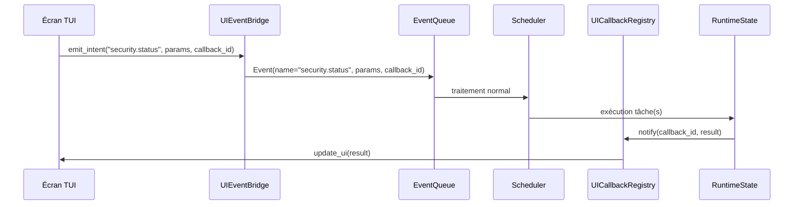

# Bridge UI‑Scheduler

Ce document décrit comment l'interface utilisateur (TUI) émet des intents et reçoit les résultats du scheduler, sans contourner l'architecture event‑driven.

## Vue d'ensemble

Le scheduler fsdeploy fonctionne sur un modèle **Event → Intent → Task**. La TUI, bien qu'exécutée dans un thread séparé, doit respecter ce pipeline pour toute opération qui modifie l'état du système (montage, snapshot, stream, etc.).

Le pont entre la TUI et le scheduler est assuré par deux mécanismes complémentaires :

1. **`UIEventBridge`** – une classe dédiée qui transforme les actions utilisateur en événements et les pousse dans la `EventQueue` du scheduler.
2. **`UICallbackRegistry`** – un registre qui permet à un écran de recevoir de manière asynchrone le résultat d'un intent qu'il a émis.

Ces deux composants sont thread‑safe et garantissent que l'interface reste réactive pendant l'exécution des tâches.

## Flux typique



## Utilisation depuis un écran Textual

Chaque écran qui a besoin d'émettre un intent doit :

1. Importer le bridge : `from fsdeploy.lib.ui.bridge import ui_event_bridge`
2. Définir une méthode de rappel (callback) qui sera appelée avec le résultat.
3. Appeler `ui_event_bridge.emit_intent(...)` en fournissant l'event name, les paramètres et l'ID du callback.

Exemple :

```python
from fsdeploy.lib.ui.bridge import ui_event_bridge

class SecurityScreen(Screen):
    def on_mount(self):
        # Enregistrement d'un callback
        ui_event_bridge.register_callback("security_status_done", self._on_security_data)

    def action_refresh(self):
        # Émission de l'intent
        ui_event_bridge.emit_intent(
            event_name="security.status",
            params={"config_path": "/etc/fsdeploy/config.fsd"},
            callback_id="security_status_done"
        )

    def _on_security_data(self, result):
        # Mise à jour de l'UI avec les données reçues
        if result.get("success"):
            rules = result.get("rules", {})
            # ... mettre à jour les DataTable
        else:
            self.notify("Échec de la récupération des règles", severity="error")
```

## Détails d'implémentation

### UIEventBridge

Le bridge est un singleton accessible dans tout le processus UI. Il maintient :

- Une référence vers la `EventQueue` du scheduler (obtenue via `get_event_queue()`).
- Un `UICallbackRegistry` qui mappe les IDs de callback vers des fonctions.
- Un thread de travail qui surveille les résultats et exécute les callbacks dans le thread de l'UI (via `call_from_thread` de Textual).

### Gestion de la thread‑safety

La `EventQueue` du scheduler est thread‑safe ; l'appel `emit_intent` peut donc être effectué depuis n'importe quel thread. Les callbacks sont toujours exécutés dans le thread principal de l'UI, ce qui garantit que les mises à jour des widgets ne provoquent pas de conditions de course.

### Timeout et erreurs

Si une tâche échoue ou dépasse un délai raisonnable, le callback reçoit un résultat contenant un champ `"error"`. L'écran peut alors afficher un message d'erreur à l'utilisateur.

## Intégration avec le scheduler existant

Le scheduler expose une méthode `push_event(event)` qui accepte des objets `Event`. Le bridge crée un tel objet en y ajoutant un champ `callback_id`. Lorsque le scheduler a terminé le traitement de l'intent, il dépose le résultat dans le `RuntimeState` avec le même `callback_id`. Le bridge interroge périodiquement le `RuntimeState` pour les callback_ids en attente.

Une alternative plus efficace utilise un `Condition` ou une `Queue` partagée, mais la version actuelle repose sur un polling léger (toutes les 100 ms) car le volume d'événements est faible.

## Exemple complet

Voir l'écran `SecurityScreen` pour un exemple opérationnel. L'écran `DebugScreen` utilise également ce mécanisme pour l'intent `debug.exec`.

## Limitations et améliorations futures

- **Portée** : le bridge ne fonctionne que lorsque la TUI et le scheduler tournent dans le même processus. Dans un déploiement distribué (UI web, socket IPC), il faudra un pont réseau.
- **Performance** : le polling des résultats introduit une latence maximale de 100 ms, acceptable pour une UI interactive.
- **Persistance des callbacks** : les callbacks ne survivent pas à un redémarrage de l'UI. Si l'UI crashe, les résultats en attente seront perdus.

---

*Documentation générée le 2026‑04‑07 – fsdeploy version 0.1.0 (alpha)*
