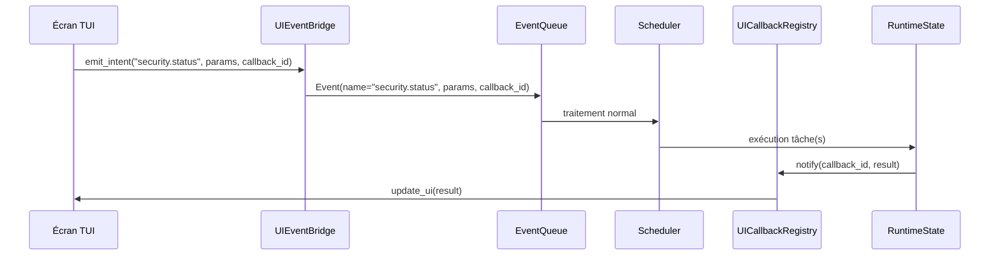

# Bridge UI‑Scheduler

Le pont entre l'interface utilisateur (UI) et le scheduler permet aux écrans d’émettre des intents et de recevoir les résultats en temps réel. Deux implémentations coexistent actuellement :

1. **SchedulerBridge / MessageBus** – le pont historique, exposant un singleton `SchedulerBridge` et un bus d'événements global.
2. **UIEventBridge / UICallbackRegistry** – le pont recommandé pour les nouveaux écrans, qui encapsule la logique de callback et garantit la thread‑safety.

Ce document décrit les deux approches et explique comment les utiliser depuis un écran Textual.

## Approche SchedulerBridge et MessageBus

Cette approche repose sur les composants `SchedulerBridge` (pont unique) et `MessageBus` (bus d'événements global). Elle est utilisée dans les écrans historiques comme `GraphViewScreen`.

### Architecture du pont

Le scheduler expose un point d'entrée unique (`SchedulerBridge`) qui permet de soumettre des intents. Ces intents sont ensuite placés dans la file `IntentQueue` et traités par le `Scheduler`. Les résultats et les événements intermédiaires sont diffusés via un bus d'événements global (`MessageBus`). L'UI peut s'abonner à ces événements pour mettre à jour l'affichage en temps réel.

### Obtenir le bridge

Dans un écran Textual, le bridge est généralement accessible via l'attribut `app.bridge` (si l'application a défini cet attribut). Sinon, vous pouvez utiliser la méthode de classe `SchedulerBridge.default()`.

```python
from fsdeploy.lib.scheduler.bridge import SchedulerBridge

bridge = SchedulerBridge.default()
```

Dans les écrans fournis (comme `GraphViewScreen`), une propriété `bridge` est déjà définie pour faciliter l'accès.

### Émettre un intent

Pour émettre un intent, il faut d'abord instancier une sous‑classe d'`Intent` avec les paramètres appropriés, puis appeler `bridge.submit(intent)`.

```python
from fsdeploy.lib.scheduler.model.intent import Intent
from fsdeploy.lib.scheduler.bridge import SchedulerBridge

class MonIntent(Intent):
    def build_tasks(self):
        # retourner la liste des tâches
        ...

bridge = SchedulerBridge.default()
intent = MonIntent(id="mon_intent", params={"cle": "valeur"})
future = bridge.submit(intent)
```

La méthode `submit` retourne un objet `concurrent.futures.Future` qui vous permet d'attendre le résultat final de l'intent (via `future.result(timeout)`), ou de vérifier son état.

### Événements du bus

Pendant l'exécution de l'intent, le scheduler émet plusieurs types d'événements sur le `MessageBus` global. Les écrans peuvent s'y abonner pour réagir à l'avancement.

Événements principaux :

- `task.started`   : une tâche a commencé.
- `task.progress`  : mise à jour de progression (si la tâche en fournit).
- `task.finished`  : une tâche s'est terminée (avec succès ou échec).
- `task.failed`    : une tâche a échoué (déclenché en plus de `task.finished`).
- `intent.resolved`: l'intent a été complètement résolu.

Exemple d'abonnement :

```python
from fsdeploy.lib.bus.event_bus import MessageBus

bus = MessageBus.global_instance()

def on_task_finished(event):
    task_id = event.data["task_id"]
    result  = event.data.get("result")
    self.notify(f"Tâche {task_id} terminée")

bus.subscribe("task.finished", on_task_finished)
```

Chaque événement transporte un dictionnaire `data` contenant les détails pertinents (identifiants, résultats, erreurs éventuelles).

### Intégration avec un écran Textual

Dans un écran Textual, il est recommandé de s'abonner aux événements dans `on_mount` et de se désabonner dans `on_unmount` pour éviter des références circulaires.

```python
class MonEcran(Screen):
    def on_mount(self):
        self.bus = MessageBus.global_instance()
        self.bus.subscribe("task.finished", self._on_task_finished)

    def on_unmount(self):
        self.bus.unsubscribe("task.finished", self._on_task_finished)

    def _on_task_finished(self, event):
        # Mettre à jour l'UI (rappelé depuis le thread du bus)
        self.call_from_thread(self.update_display, event.data)
```

Le bus exécute les callbacks dans son propre thread ; utilisez `self.call_from_thread` (méthode de `Screen`) pour mettre à jour les widgets Textual en toute sécurité.

### Exemple complet : lancer une vérification de cohérence depuis l'UI

L'écran `GraphViewScreen` (voir `fsdeploy/lib/ui/screens/graph.py`) illustre l'utilisation du bridge pour récupérer l'état courant du scheduler (`bridge.get_scheduler_state()`). Voici comment on pourrait y ajouter l'émission d'un intent de vérification de cohérence :

```python
def action_run_coherence_check(self):
    from fsdeploy.lib.intents.system_intent import CoherenceCheckIntent
    intent = CoherenceCheckIntent(id="coherence_ui", params={})
    future = self.bridge.submit(intent)
    # vous pouvez choisir d'attendre de manière asynchrone
    # ou simplement laisser l'intent s'exécuter en arrière‑plan.
```

### Dépannage

- **`SchedulerBridge.default()` lève une exception** : assurez‑vous que le scheduler a été démarré avant d'utiliser le bridge (normalement pris en charge par l'application principale).
- **Les événements ne sont pas reçus** : vérifiez que vous vous êtes bien abonné avant le début de l'exécution de l'intent. Le bus ne garde pas d'historique des événements déjà émis.
- **L'UI ne se met pas à jour** : pensez à appeler `self.call_from_thread` car les callbacks du bus sont exécutés hors du thread de l'interface.

### Références

- `fsdeploy/lib/scheduler/bridge.py` – implémentation du pont.
- `fsdeploy/lib/bus/event_bus.py` – bus d'événements global.
- `fsdeploy/lib/scheduler.model.intent.py` – base des intents.
- `fsdeploy/lib/ui/screens.graph.py` – exemple d'écran utilisant le bridge.

## Approche UIEventBridge et UICallbackRegistry

Ce pont plus récent est recommandé pour les nouveaux écrans. Il encapsule la logique de callback et garantit la thread‑safety.

### Vue d'ensemble

Le scheduler fsdeploy fonctionne sur un modèle **Event → Intent → Task**. La TUI, bien qu'exécutée dans un thread séparé, doit respecter ce pipeline pour toute opération qui modifie l'état du système (montage, snapshot, stream, etc.).

Le pont entre la TUI et le scheduler est assuré par deux mécanismes complémentaires :

1. **`UIEventBridge`** – une classe dédiée qui transforme les actions utilisateur en événements et les pousse dans la `EventQueue` du scheduler.
2. **`UICallbackRegistry`** – un registre qui permet à un écran de recevoir de manière asynchrone le résultat d'un intent qu'il a émis.

Ces deux composants sont thread‑safe et garantissent que l'interface reste réactive pendant l'exécution des tâches.

### Flux typique



### Utilisation depuis un écran Textual

Chaque écran qui a besoin d'émettre un intent doit :

1. Importer le bridge : `from fsdeploy.lib.ui.bridge import ui_event_bridge`
2. Définir une méthode de rappel (callback) qui sera appelée avec le résultat.
3. Appeler `ui_event_bridge.emit_intent(...)` en fournissant l'event name, les paramètres et l'ID du callback.

Exemple :

```python
from fsdeploy.lib.ui.bridge import ui_event_bridge

class SecurityScreen(Screen):
    def on_mount(self):
        # Enregistrement d'un callback
        ui_event_bridge.register_callback("security_status_done", self._on_security_data)

    def action_refresh(self):
        # Émission de l'intent
        ui_event_bridge.emit_intent(
            event_name="security.status",
            params={"config_path": "/etc/fsdeploy/config.fsd"},
            callback_id="security_status_done"
        )

    def _on_security_data(self, result):
        # Mise à jour de l'UI avec les données reçues
        if result.get("success"):
            rules = result.get("rules", {})
            # ... mettre à jour les DataTable
        else:
            self.notify("Échec de la récupération des règles", severity="error")
```

### Détails d'implémentation

#### UIEventBridge

Le bridge est un singleton accessible dans tout le processus UI. Il maintient :

- Une référence vers la `EventQueue` du scheduler (obtenue via `get_event_queue()`).
- Un `UICallbackRegistry` qui mappe les IDs de callback vers des fonctions.
- Un thread de travail qui surveille les résultats et exécute les callbacks dans le thread de l'UI (via `call_from_thread` de Textual).

#### Gestion de la thread‑safety

La `EventQueue` du scheduler est thread‑safe ; l'appel `emit_intent` peut donc être effectué depuis n'importe quel thread. Les callbacks sont toujours exécutés dans le thread principal de l'UI, ce qui garantit que les mises à jour des widgets ne provoquent pas de conditions de course.

#### Timeout et erreurs

Si une tâche échoue ou dépasse un délai raisonnable, le callback reçoit un résultat contenant un champ `"error"`. L'écran peut alors afficher un message d'erreur à l'utilisateur.

### Intégration avec le scheduler existant

Le scheduler expose une méthode `push_event(event)` qui accepte des objets `Event`. Le bridge crée un tel objet en y ajoutant un champ `callback_id`. Lorsque le scheduler a terminé le traitement de l'intent, il dépose le résultat dans le `RuntimeState` avec le même `callback_id`. Le bridge interroge périodiquement le `RuntimeState` pour les callback_ids en attente.

Une alternative plus efficace utilise un `Condition` ou une `Queue` partagée, mais la version actuelle repose sur un polling léger (toutes les 100 ms) car le volume d'événements est faible.

### Exemple complet

Voir l'écran `SecurityScreen` pour un exemple opérationnel. L'écran `DebugScreen` utilise également ce mécanisme pour l'intent `debug.exec`.

### Limitations et améliorations futures

- **Portée** : le bridge ne fonctionne que lorsque la TUI et le scheduler tournent dans le même processus. Dans un déploiement distribué (UI web, socket IPC), il faudra un pont réseau.
- **Performance** : le polling des résultats introduit une latence maximale de 100 ms, acceptable pour une UI interactive.
- **Persistance des callbacks** : les callbacks ne survivent pas à un redémarrage de l'UI. Si l'UI crashe, les résultats en attente seront perdus.

---

*Documentation générée le 2026‑04‑07 – fsdeploy version 0.1.0 (alpha)*
