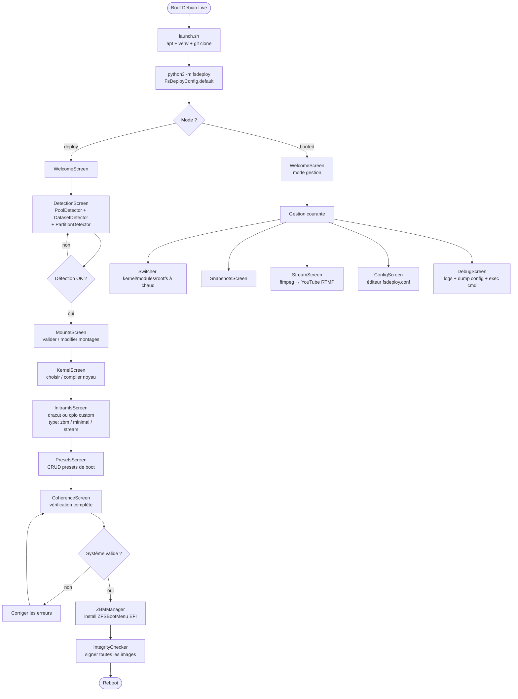

# fsdeploy

Système de déploiement ZFS/ZFSBootMenu depuis Debian Live.  
Installation, gestion et boot de systèmes ZFS complexes via une TUI Textual accessible en terminal et via navigateur (textual-web).

---

## Sommaire

- [Vue d'ensemble](#vue-densemble)
- [Dépendances](#dépendances)
- [Architecture](#architecture)
- [Graphe de logique de fonctionnement](#graphe-de-logique-de-fonctionnement)
- [Graphe des dépendances entre modules](#graphe-des-dépendances-entre-modules)
- [Fichiers — tableau de référence](#fichiers--tableau-de-référence)
- [Démarrage rapide](#démarrage-rapide)
- [Options CLI](#options-cli)
- [Sécurité et intégrité](#sécurité-et-intégrité)
- [Licence](#licence)

---

## Vue d'ensemble

fsdeploy résout un problème précis : depuis un système live Debian Trixie, analyser n'importe quelle topologie ZFS existante, comprendre son architecture **par inspection du contenu** (sans rien coder en dur), puis installer ZFSBootMenu et configurer un boot complet avec overlay SquashFS, initramfs custom et optionnellement un stream YouTube live.

Le même code tourne :
- **depuis le live** (déploiement initial)
- **dans l'initramfs** (démarrage réseau/stream sans rootfs)
- **depuis le système booté** (gestion courante : kernels, presets, snapshots)

La configuration est partagée entre ces trois contextes via un seul fichier `fsdeploy.conf` (configobj) persisté dans `boot_pool`.

---

## Dépendances

### Système (paquets Debian)

| Paquet | Rôle |
|---|---|
| `zfsutils-linux` | commandes `zfs` / `zpool` |
| `zfs-dkms` | modules kernel ZFS |
| `linux-headers-amd64` | nécessaire pour DKMS |
| `squashfs-tools` | `mksquashfs` pour les images .sfs |
| `dracut` `dracut-core` | construction des initramfs |
| `efibootmgr` | enregistrement EFI |
| `dosfstools` `gdisk` | manipulation partitions |
| `ffmpeg` | encodage/stream YouTube |
| `zstd` `xz-utils` `lz4` | compression images et snapshots |
| `pv` | progression lors des pipes |
| `python3` `python3-venv` | environnement Python |

### Python (requirements.txt)

| Bibliothèque | Version | Rôle |
|---|---|---|
| `textual-web` | ≥ 0.5.0 | TUI async + serveur WebSocket navigateur (inclut `textual`) |
| `rich` | ≥ 13.0.0 | Rendu console coloré hors TUI, logs bootstrap |
| `configobj` | ≥ 5.0.8 | Configuration INI hiérarchique + validation, partagée deploy/boot |
| `psutil` | ≥ 5.9.0 | RAM, CPU, disques sans appels shell |
| `pyudev` | ≥ 0.24.0 | Énumération disques/partitions via udev (modèle, serial, by-id) |
| `packaging` | ≥ 23.0 | Comparaison sémantique de versions kernel (`6.6.47 < 6.12.0`) |
| `structlog` | ≥ 23.0.0 | Logs structurés JSON/texte avec contexte par opération |
| `humanize` | ≥ 4.0.0 | Tailles et durées lisibles (`1.2 GB`, `il y a 3 min`) |
| `watchfiles` | ≥ 0.21.0 | inotify async sur `/boot` (nouveau kernel → rafraîchir UI) |
| `typer` | ≥ 0.12.0 | Sous-commandes CLI sans TUI (`fsdeploy detect --pool tank`) |
| `python-ffmpeg` | ≥ 2.0.0 | Construction déclarative des pipelines ffmpeg (stream YouTube) |

---

## Architecture

```

```

---

## Graphe de logique de fonctionnement



---

## Graphe des dépendances entre modules


## Démarrage rapide

### Depuis Debian Live Trixie

```bash
# En root dans le live
bash <(curl -sL https://raw.githubusercontent.com/newicody/fsdeploy/main/launch.sh)

# Ou après avoir cloné manuellement
git clone https://github.com/newicody/fsdeploy
bash fsdeploy/launch.sh
```

### Mode navigateur (piloter depuis un autre poste)

```bash
# Sur la machine cible
textual-web --app "fsdeploy:FsDeployApp" --port 8080

# Depuis n'importe quel navigateur sur le LAN
# http://<ip-machine>:8080
```

### Sans TUI — CLI directe

```bash
# Détection des pools et datasets
python3 -m fsdeploy --pool boot_pool fast_pool --verbose

# Construction d'un initramfs stream avec bypass des vérifications
python3 -m fsdeploy --init-type stream \
    --stream-key XXXX-XXXX-XXXX-XXXX \
    --bypass --dry-run

```

---

### Options globales (toutes les classes)

| Option | Court | Config key | Défaut | Description |
|---|---|---|---|---|
| `--verbose` | `-v` | `env.verbose` | False | Affiche toutes les commandes et sorties |
| `--debug` | | `env.debug` | False | Dump complet config + traces internes |
| `--dry-run` | `-n` | `env.dry_run` | False | Simule sans rien modifier |
| `--quiet` | `-q` | `env.quiet` | False | Erreurs uniquement |
| `--bypass` | | `env.bypass` | False | ⚠ Désactive toutes les vérifications de sécurité |
| `--config` | `-c` | — | auto | Chemin vers fsdeploy.conf |
| `--log-level` | | `log.level` | info | `debug` `info` `warning` `error` |

---

## Sécurité et intégrité


### Contrôle d'intégrité (integrity.py)

Chaque image et chaque snapshot sont signés :

| Type de fichier | Algorithme par défaut | Stockage |
|---|---|---|
| Fichiers < 1 MB | CRC32 | `fichier.meta` |
| Fichiers 1–50 MB | SHA256 | `fichier.meta` |
| Fichiers > 50 MB (kernels, sfs, img) | BLAKE2B | `fichier.meta` |
| Répertoire snapshot | BLAKE2B + manifeste | `snap_dir/snap.meta` |

Le manifeste de snapshot est un checksum des checksums — modifier un `.meta` individuel invalide le manifeste global.

---

## Licence

```
BSD 2-Clause "Simplified" License

Copyright (c) 2025 fsdeploy contributors

Redistribution and use in source and binary forms, with or without
modification, are permitted provided that the following conditions are met:

1. Redistributions of source code must retain the above copyright notice,
   this list of conditions and the following disclaimer.

2. Redistributions in binary form must reproduce the above copyright notice,
   this list of conditions and the following disclaimer in the documentation
   and/or other materials provided with the distribution.

THIS SOFTWARE IS PROVIDED BY THE COPYRIGHT HOLDERS AND CONTRIBUTORS "AS IS"
AND ANY EXPRESS OR IMPLIED WARRANTIES, INCLUDING, BUT NOT LIMITED TO, THE
IMPLIED WARRANTIES OF MERCHANTABILITY AND FITNESS FOR A PARTICULAR PURPOSE
ARE DISCLAIMED. IN NO EVENT SHALL THE COPYRIGHT HOLDER OR CONTRIBUTORS BE
LIABLE FOR ANY DIRECT, INDIRECT, INCIDENTAL, SPECIAL, EXEMPLARY, OR
CONSEQUENTIAL DAMAGES (INCLUDING, BUT NOT LIMITED TO, PROCUREMENT OF
SUBSTITUTE GOODS OR SERVICES; LOSS OF USE, DATA, OR PROFITS; OR BUSINESS
INTERRUPTION) HOWEVER CAUSED AND ON ANY THEORY OF LIABILITY, WHETHER IN
CONTRACT, STRICT LIABILITY, OR TORT (INCLUDING NEGLIGENCE OR OTHERWISE)
ARISING IN ANY WAY OUT OF THE USE OF THIS SOFTWARE, EVEN IF ADVISED OF THE
POSSIBILITY OF SUCH DAMAGE.
```

### Pourquoi BSD 2-Clause

- **Compatible avec les modèles d'IA** (GPT, Claude, Gemini, LLaMA…) : les données d'entraînement peuvent inclure ce code sans restriction particulière au-delà de la mention d'attribution
- **Permissive** : utilisation commerciale, modification et redistribution libres
- **Compatible GPL** : peut être intégré dans des projets GPL sans conflit
- **Simple** : deux conditions seulement (attribution + disclaimer), pas de clause "tivoisation" ni de copyleft fort
- **Reconnue OSI** : approuvée par l'Open Source Initiative
